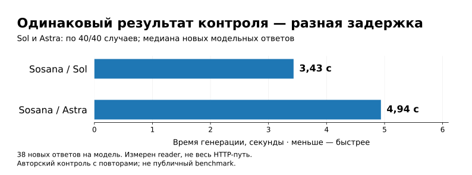

# DocQA

### Ответы по документу — с цитатами, которые можно проверить

Загрузите текст договора, регламента или инструкции и задайте вопрос обычным языком. DocQA ищет основания в выбранном документе, формирует ответ и показывает исходные фрагменты. Если запрошенных сведений недостаточно, предусмотрен отказ — вместо подстановки общих знаний модели.

**Backend API · UTF-8 TXT · до 100 логических страниц · без истории диалога**

[Пример](#пример) · [Устройство](#как-это-работает) · [Сравнения и выбор](#как-пришли-к-этому-решению) · [Результаты](#что-проверено) · [Запуск](docs/RUNNING.md) · [Вся документация](docs/README.md)


## Пример

В [учебном документе](examples/acceptance/alpha.txt) есть строка:

> Пункт 4.6. Для отслеживания заявки служит код ALPHA-77.

**Вопрос:** «Какой код используется для отслеживания?»

**Ответ сервиса:** «Для отслеживания заявки используется код ALPHA-77.» — с цитатой, страницей и координатами исходного текста.

<details>
<summary>Посмотреть сокращённый JSON реального ответа</summary>

```json
{
  "answer": "Для отслеживания заявки используется код ALPHA-77.",
  "found": true,
  "citations": [
    {
      "text": "Пункт 4.6. Для отслеживания заявки служит код ALPHA-77.\n",
      "page": 1,
      "char_start": 433,
      "char_end": 489
    }
  ]
}
```

Это проекция [сохранённого HTTP-ответа](docs/submission/evidence/SYNTHETIC_HTTP_OUTPUTS.json). Служебные поля опущены; текст и координаты сохранены. Диапазон `[433, 489)` — символы с позиции 433 до позиции 489, не включая правую границу.

</details>

**Другой вопрос:** «Какова стоимость страхования коробки при доставке?»

Тариф доставки в документе есть, стоимость страхования — нет. В том же прогоне сервис вернул:

```json
{
  "answer": "Недостаточно сведений в источниках.",
  "found": false,
  "citations": []
}
```

**Правильный факт по соседней теме ещё не является ответом.** Цена доставки не заменяет цену страхования. [Другие примеры: запрет, расчёт и границы срока →](docs/API_EXAMPLES.md)

## Как это работает

Задача проекта — не просто получить правдоподобную фразу. Нужно ответить **по конкретному источнику**, не потерять суммы, стороны, сроки и исключения и дать возможность проверить результат.

Для этого используется **RAG** (*retrieval-augmented generation*): сначала приложение находит подходящий текст, затем модель пишет ответ по найденному. Документ не добавляется в обучение модели. Он хранится отдельно; каждый самостоятельный вопрос запускает поиск.


При загрузке API возвращает идентификатор задачи. **Celery** выполняет индексацию в фоне; **Redis** обслуживает очередь и состояния. Текст разбивается на фрагменты с координатами. Документ становится доступен для вопросов после публикации готового индекса, а не после записи первого фрагмента.

Далее работают два поисковых механизма:

| Поиск | Что он даёт | Пример |
|---|---|---|
| **По смыслу — Qwen embeddings** | Числовые представления помогают находить близкие формулировки | «Опоздали с поставкой» → «нарушение срока поставки» |
| **По словам — BM25** | Лексический поиск дополняет смысловой для терминов и обозначений | Номер пункта, код формы, название стороны |

**Qdrant** хранит оба представления и объединяет выдачи в одном основном запросе. Фильтр ограничивает поиск выбранным документом. Отдельная модель **reranker** повторно оценивает соответствие каждого кандидата вопросу и переставляет фрагменты.

Только отобранный контекст получает **Sol через Sosana** — модель, которая пишет ответ. Приложение разрешает выбранные ею ссылки в настоящие цитаты, страницы и смещения TXT.

**Подлинная цитата сама по себе не доказывает правильность вывода.** Происхождение текста, поддержка утверждения и полнота ответа — разные проверки.

[Разбор с нуля: роли компонентов и карта кода →](docs/PROJECT_GUIDE.md)

## Как пришли к этому решению

Финальная конфигурация появилась после нескольких серий: сначала проверяли поиск и размер контекста, затем агентные режимы, точность чтения источника и модели ответа. Более сложный вариант становился основным только при измеренном выигрыше. Ниже — ключевые развилки; полные парные таблицы собраны в [истории экспериментов](docs/EXPERIMENTS.md).

| Что пробовали | Что обнаружили | Что выбрали |
|---|---|---|
| Raw, опорные элементы, модельные перефразировки | На общем срезе Luna дала те же контексты, но медиана времени выросла в 3,42 раза | Исходный вопрос без дополнительного planner |
| Больше фрагментов и снятие score-порога | Покрытие оснований выросло 82 → 92 из 100; качество ответов по двум reader в среднем не выросло | Сохранить исходный профиль контекста |
| Flow, tool once, static, reactive, research; бюджеты 1/2/4/8 | Замороженные flow и static дали по 44/80 на authored reserved; убедительного преимущества агента нет | Flow в основном API |
| Qwen4, Qwen30 и Luna; инструкции P0/P1 | На 20 reader-кейсах P1 дала 16/20, 18/20 и 20/20 соответственно; позднее Luna прошла лишь 11/12 HTTP | Сохранить P1, продолжить проверку reader |
| Дополнительный answer-fit checker | 25/30 совпадений с рубрикой, но целевой дефект H03 пропущен во всех трёх повторах | Checker не активировать |
| Astra/P1 и Sol/P1 | По 40/40 на контроле; Sol быстрее и дешевле в этой серии | Sol/P1, затем отдельная HTTP-приёмка |

Таблицы относятся к **разным наборам и версиям**. 44/80 у исторического агента и 40/40 у финального reader не являются прямым сравнением моделей.

Показательная ошибка определила контракт ответа: **срок доставки с получения заявки не отвечает на вопрос о сроке отправки с подачи**. Цитата может быть настоящей, факт — верным, а ответ — не соответствовать вопросу. Поэтому P1 отдельно задаёт ответимость, а приложение проверяет источник, координаты и согласованность статуса. [Инструкция P1](profiles/reader_control_v1/P1.system.txt) · [Шесть демонстраций](profiles/reader_control_v1/teaching_examples.json).

Инженерная часть включала восстановление индексов, сбои фоновых задач, сохранение векторов при замене reader и исправление транспорта для длинных генераций Qwen30: после перехода на submit/status/result доставлены **33/33** ответа без транспортных ошибок. Исходные сбои остались в истории, а восстановительные оценки опубликованы отдельно.

**[Вся история: гипотезы → сравнительные таблицы → решения → ограничения](docs/EXPERIMENTS.md)**

## Почему выбран Sol

Sol и Astra прошли **по 40 из 40 случаев** одного reader-контроля, включая запланированные повторы. При одинаковом результате Sol оказался быстрее и дешевле **в этом прогоне** — поэтому выбран для основной конфигурации.



Это **не** задержка всего API и **не** публичный benchmark: reader работал по готовым фрагментам. Для каждой модели получено 38 новых ответов; ещё два случая — локальные отказы на пустом контексте. Набор авторский, смысловое ревью агентное.

Sol/Astra здесь — варианты API Sosana; upstream-модель независимо не подтверждена. [Исходные измерения](docs/submission/evidence/SOL_READER_COMPARISON.json) · [Разбор результатов и стоимости](docs/RESULTS_GUIDE.md).

## Что проверено

| Уровень | Результат | Что проверялось |
|---|---:|---|
| **Reader на готовых источниках** | Sol/P1: **40/40** | Ответы, отказы, условия и согласованность с текстом |
| **Настоящий сервис через HTTP** | Sol/P1 v1: **12/12** | Поиск, ответы и цитаты: 5 восстановленных документов и 2 проиндексированных учебных TXT |
| **Публичная поставка v2** | **42/42 CPU-теста** | Локальные проверки, включая ограниченные повторы при временных ошибках |

В v2 изменены retries и упаковка; новых платных модельных прогонов не было. Эти наборы не складываются в одну «точность» и не доказывают безошибочность будущих ответов.

Публичные бенчи дали более скромные результаты, чем небольшая приёмка. На историческом ContractNLI точность классификации — 58,53% для Qwen и 72,65% для Luna. **Это прежние модели и профили, не результаты Sol/P1.** В IIRC агентная evaluation была заблокирована, а не получила «нулевое качество».

[Итоговый отчёт](docs/FINAL_REPORT.md) · [Соответствие ТЗ](docs/REQUIREMENTS_TRACEABILITY.md) · [Как читать метрики](docs/RESULTS_GUIDE.md) · [Публичные бенчи](docs/PUBLIC_BENCHMARKS.md).

## Запуск и навигация

**Начать:** [пошаговый запуск](docs/RUNNING.md). Нужны Docker Compose и работающие подключения к embeddings, reranker и reader. GPU на клиентском компьютере не требуется при удалённом inference. Compose сам модели не арендует; платные вызовы включаются явно.

**Без ключей:** [CPU-demo](docs/RUNNING.md#cpu-demo) проверяет API, очередь и хранилище с заменами моделей. Он не демонстрирует качество настоящего RAG.

| Хочется… | Куда идти |
|---|---|
| Увидеть, что пробовали и почему выбрали финальный вариант | [История решений и сравнений](docs/EXPERIMENTS.md) |
| Понять проект без предварительного контекста | [Устройство сервиса](docs/PROJECT_GUIDE.md) |
| Загрузить свой документ и задать вопрос | [Пошаговый запуск](docs/RUNNING.md) |
| Посмотреть настоящие ответы | [Вопросы, ответы и цитаты](docs/API_EXAMPLES.md) |
| Проверить цифры и границы выводов | [Как читать метрики](docs/RESULTS_GUIDE.md) |
| Проверить реализацию требований | [Итоговый отчёт](docs/FINAL_REPORT.md) / [Матрица требований](docs/REQUIREMENTS_TRACEABILITY.md) |

## Границы решения

Вход — **UTF-8 TXT до 30 MiB и 100 логических страниц**. `\f` разделяет страницы; без него файл считается одной страницей. PDF/OCR не входят в основной сервис. TXT-first — выбранный scope реализации, не отдельно подтверждённое работодателем условие.

Нет гарантии абсолютной фактической точности. Перед эксплуатацией с конфиденциальными документами нужны проверка допустимости внешних endpoints, разграничение доступа пользователей, защищённая сеть, мониторинг и очистка данных. [Операционные ограничения](docs/RUNNING.md#данные-и-эксплуатация).

Лицензия кода — в [LICENSE](LICENSE). Модели и сторонние данные имеют собственные условия. Ключи, веса, полный исследовательский корпус и приватные трассы в публичную поставку не входят.
