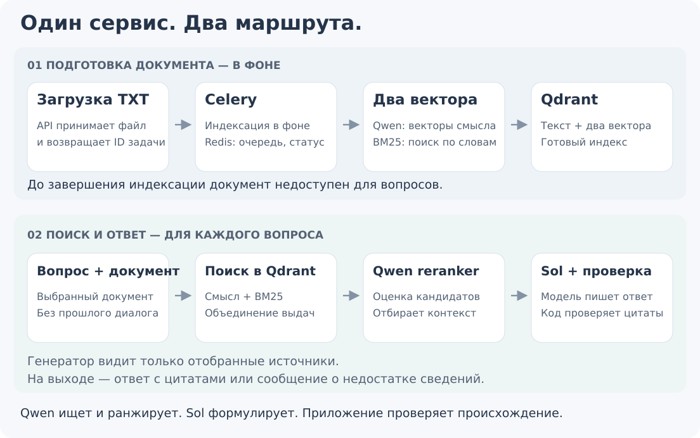

# DocQA с нуля

[Документация](README.md) · [История решений](EXPERIMENTS.md) · [Главная проекта](../README.md)

## От одного договора к ответу

Представим договор на несколько десятков страниц. Нужно узнать санкцию за задержку поставки. Слово «штраф» может отсутствовать: документ называет её «неустойкой». А в отдельном пункте может находиться ограничение её размера.

DocQA делает две работы: **подготавливает документ к поиску**, затем **отвечает на конкретный вопрос**. Это RAG: сначала найти основания, потом написать ответ. Новая языковая модель на загруженном файле не обучается.

## Что происходит при загрузке

**API принимает TXT.** API — программный интерфейс: вместо кнопки клиент отправляет HTTP-запрос. Пользовательского интерфейса в задании нет; для проверки подходят `curl` и Python-клиент.

**Создаётся фоновая задача.** Индексация не должна задерживать ответ на загрузку. Клиент получает ID задачи и запрашивает её состояние. Celery исполняет работу отдельно от обработки HTTP-запросов.

**Текст разбивается на фрагменты.** Фрагмент, или *chunk*, — небольшой участок исходного текста. Сохраняются документ, порядок, страница и координаты символов. По ним позже можно вернуть настоящее место источника.

**Строятся два поисковых представления.** Qwen embedding преобразует фрагмент в числовой вектор для смыслового поиска. BM25 готовит разреженное лексическое представление. Оба вектора и текст находятся в одной точке Qdrant.

**Публикуется готовая версия.** Пока новый индекс строится, частичный результат недоступен для QA. После проверок переключается указатель на готовое состояние. В коде такая версия называется *generation*, сохранённое состояние — *snapshot*. Это не генерация ответа: одинаковое слово используется для разных операций.

## Что происходит при вопросе

Клиент передаёт **`document_id` и вопрос**. Внутри кода идентификатор документа также называется `doc_id`. Поиск ограничен этим документом. Похожее условие соседнего договора не должно стать источником ответа.

Два поиска дают кандидатов. Их объединение называется *fusion* и выполняется внутри Qdrant. Затем **reranker** оценивает пары «вопрос — фрагмент» и переставляет кандидатов. Это отдельная модель, не другое название векторного поиска.

Из отобранных фрагментов собирается **контекст ответа**, или *pack*. В основном профиле предусмотрены до 24 кандидатов для reranker, до шести итоговых фрагментов и до 8 000 символов pack; действуют и отдельные ограничения полного модельного входа.

**Reader** — модель, которая формулирует ответ. Сейчас это Sol через Sosana. Она получает вопрос, источники и P1 с шестью учебными примерами. P1 — версия нашей инструкции, а не ещё одна модель.

Приложение разрешает ссылки reader в настоящие диапазоны TXT и собирает публичный JSON. Пустой pack, найденный отрицательный факт и технический сбой — разные ситуации.

## Кто за что отвечает

| Компонент | Простыми словами | Не делает |
|---|---|---|
| **FastAPI** | Принимает запросы, возвращает JSON | Не генерирует текст сам |
| **Celery** | Выполняет индексацию в фоне | Не определяет смысл ответа |
| **Redis** | Очередь, статусы и служебный каталог | Не заменяет векторный поиск |
| **Qdrant** | Хранит фрагменты и ищет по ним | Не пишет ответ |
| **Qwen embedding** | Кодирует текст для смыслового поиска | Не является читателем договора |
| **Qwen reranker** | Повторно оценивает кандидатов | Не формирует итоговую формулировку |
| **Sol / reader** | Пишет ответ, выбирает источники | Не меняет исходный документ |
| **LangChain** | Соединяет splitter, embeddings и модельные вызовы | Не гарантирует качество сам по себе |
| **Pydantic** | Проверяет структуру и допустимые поля | Не доказывает истинность вывода |

Qwen в поиске и Sol в генерации — независимые роли. Им необязательно принадлежать одному семейству.

## Три разных вопроса к качеству

**Источник существует?** Проверяется по документу, диапазону и исходному тексту.

**Источник подтверждает утверждение?** Настоящая цитата с числом может относиться к другой стороне, сроку или единице измерения.

**Утверждение отвечает на вопрос?** Верный тариф доставки не сообщает стоимость страхования.

Проверка координат закрывает первый слой. Инструкция, строгая сборка ответа и содержательные тесты работают со вторым и третьим — без универсальной гарантии. В основном профиле дополнительный LLM-критик выключен; он не служит обязательным разрешающим фильтром.

`found=false` возвращается при недостатке сведений, неоднозначности или противоречии в источниках; точное состояние отражается в `status`. Недоступная модель или неготовый документ возвращаются как отдельный технический результат.

## Карта репозитория

| Путь | Содержание |
|---|---|
| [`docqa_service/`](../docqa_service/) | API, задачи, жизненный цикл документов |
| [`docqa_rag/`](../docqa_rag/) | Поиск, модели, pack, цитаты, библиотечное ядро |
| [`profiles/submission/`](../profiles/submission/) | Выбранная конфигурация поставки |
| [`profiles/reader_control_v1/`](../profiles/reader_control_v1/) | P1 и примеры — несмотря на историческое имя, они нужны текущему reader |
| [`profiles/stage_2/compose.yaml`](../profiles/stage_2/compose.yaml) | Основной запуск сервисов; имя `stage_2` историческое |
| [`tests/`](../tests/) и [`examples/`](../examples/) | Публичные проверки и небольшие документы |
| [`docqa_corpus/`](../docqa_corpus/) | Инструменты исследовательских наборов; полный corpus/gold не опубликован |
| [`docqa_rag/agent_loop/`](../docqa_rag/agent_loop/) | Экспериментальный последовательный поиск |

Для знакомства достаточно **README → эта страница → RUNNING**. Все исторические стадии читать не требуется.

## Зачем здесь модульность

Меняем reader — совместимые документные векторы остаются. Меняем разбиение или document-side encoder — нужен соответствующий индекс. Разные эксперименты не должны незаметно использовать несовместимые кэши.

Разделение компонентов помогает найти место ошибки: **источник не нашли, потеряли при отборе, неправильно прочитали или неверно оценили ответ**. Четыре причины требуют разных исправлений.

Конкретные модели и revisions защищены проверками совместимости. Произвольная замена имени в `.env` может быть отклонена. Поддерживаемые подключения — в [MODEL_ENDPOINTS](MODEL_ENDPOINTS.md).
