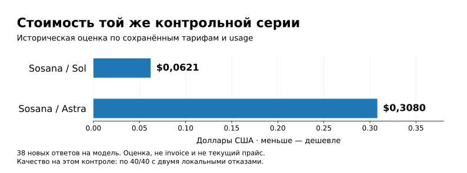
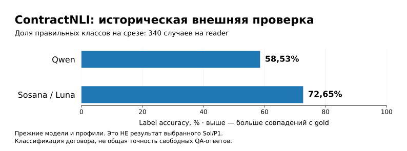

# Как читать результаты DocQA

[Документация](README.md) · [История решений](EXPERIMENTS.md) · [Главная проекта](../README.md)

У проекта нет одной честной цифры «точность RAG». Тест запуска, выбор источников и правильность ответа измеряют разные свойства. Здесь они разделены.

## Выбор reader

Sol и Astra получили одну постановку и подготовленные источники. Оба прошли 40/40 контрольных случаев: 38 новых модельных ответов и два локальных отказа на пустом контексте. В составе есть заранее запланированные повторы; это не 40 независимых документов.

| Показатель | Sol | Astra |
|---|---:|---:|
| Прошли принятую рубрику | 40/40 | 40/40 |
| Новые модельные ответы | 38 | 38 |
| Медиана генерации | 3,43 с | 4,94 с |
| Оценка стоимости серии по usage | $0,0621 | $0,3080 |

Правило выбора было зафиксировано заранее: корректность, устойчивость повторов, затем средняя задержка и стоимость. Средняя задержка составила 3,83 с для Sol и 5,17 с для Astra; график выше отдельно показывает медиану.

**Решение:** при одинаковом результате этого контроля выбран Sol — с меньшей измеренной задержкой и расчётной стоимостью. Это не утверждение о превосходстве на любых документах.

Источник — [SOL_READER_COMPARISON.json](submission/evidence/SOL_READER_COMPARISON.json). Цена — расчёт по зафиксированным тарифам и токенам, не invoice и не актуальный прайс. Задержка относится только к генерации. Sol/Astra — варианты провайдера Sosana без независимой аттестации upstream. Контроль авторский, содержательное ревью агентное.

## Сквозная проверка сервиса

После выбора reader Sol/P1 v1 прошёл **12/12 HTTP-проверок**. Здесь проверялся сервисный путь: пять документов восстановили из готового индекса, два существующих учебных TXT проиндексировали заново, затем выполнили поиск, генерацию и проверку цитат. Все прежние документные векторы переиспользовались; это не повтор полной холодной индексации. Случаи включают точное обозначение, отсутствие стоимости страхования, запрет, расчёт, существующие реальные TXT и факт на сотой логической странице.

Открыто выложены [девять синтетических примеров](API_EXAMPLES.md). Это не все 12: реальные TXT и приватные материалы исключены из публичной поставки.

Показательный случай: источник задаёт срок **доставки с получения заявки**, вопрос — **отправки с подачи**. В сохранённом прогоне Sol вернул `not_found`, не подменяя условия. Обратные проверки контролируют, что прямая эквивалентность в источнике и обычная перефразировка не приводят к ненужному отказу.

Это ограниченная приёмка, не массовая независимая оценка качества.

## Что изменилось в v2

Включены **до трёх попыток всего** при классифицированных временных сбоях и обновлена упаковка. Reader, P1 и содержательная настройка retrieval не менялись; новых платных ответов не получали.

Публичный CPU-набор — **42/42**, включая 25 новых retry-проверок. Числа не складываются: наборы пересекаются. Запуск одного набора на host, в release-папке и Linux не создаёт новые независимые тесты.

Исторические **712 passed / 8 skipped** относятся к более полному прежнему checkout. Открытая поставка не содержит все приватные fixtures и не обязана повторять то же число. [Версии и доказательства](FINAL_REPORT.md).

## Публичные бенчи

На историческом **ContractNLI** классифицировалось утверждение относительно договора: подтверждено, опровергнуто, не упомянуто. Accuracy здесь — совпадение с официальной меткой, не общая точность свободных ответов.

| Reader прежнего эксперимента | Верный класс | Macro-F1 |
|---|---:|---:|
| Qwen | 199/340 — 58,53% | 56,11% |
| Sosana/Luna | 247/340 — 72,65% | 67,92% |

**Эти показатели не относятся к Sol/P1.** Правильный класс также не гарантирует корректность каждого пояснения и цитаты. Ошибки выполненного плана остаются в фиксированном знаменателе.

На 100 вопросах **IIRC**, где начального контекста может не хватать, flow получил EM 29% / F1 31,70%, static — 25% / 27,03%. Агентная evaluation не запускалась после провала train-gate: результат **N/A**, не 0%.

[Официальная сводка проекта](PUBLIC_BENCHMARKS.md) сохраняет эти ограничения. Полные pilots и evaluator data не входят в открытую поставку; это не полный leaderboard-пакет.

## Какой вывод допустим

**Подтверждено на перечисленных проверках:** рабочий API, выбранный reader, проверка происхождения цитат, ограниченные повторы временных ошибок.

**Не подтверждено:** нулевой риск смысловой ошибки, равенство найденной цитаты полному ответу, перенос старых benchmark-метрик на новый reader, преимущество экспериментального агента над flow.

Графики визуализируют опубликованные сводки, не новые запуски. [Данные и provenance](assets/metrics.json); воспроизведение — `python scripts/render_readme_visuals.py` с установленным matplotlib. Работа сервиса от matplotlib не зависит.
